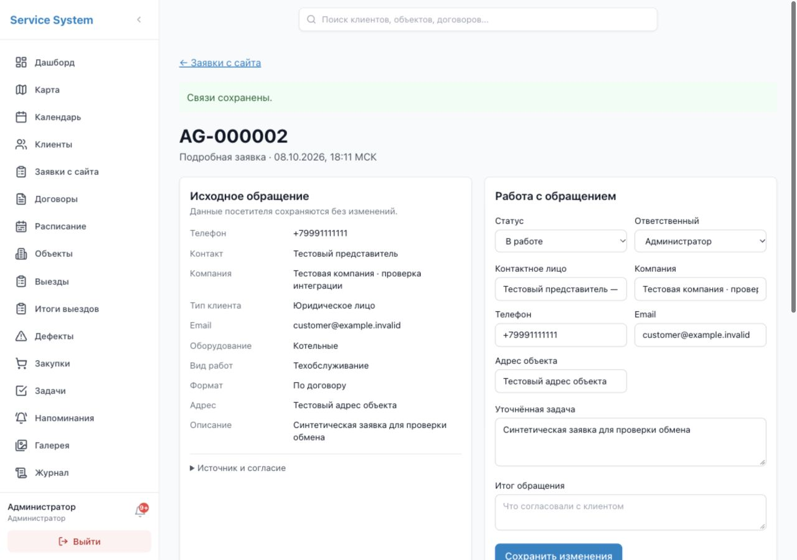

# Заявки с сайта · 8 октября 2026

Реализовано в `codex/website-service-requests` на основе `dev`, `cea3ad8`. Рабочий сервер этим этапом не обновлялся. Сайт находится в отдельном [репозитории](https://github.com/Relvx/analitgaz-website/tree/codex/blue-brand-redesign).

## Что работает

- Отдельные обращения с сайта: исходный JSON без изменения представления полей, нормализованный хеш для сравнения повторов, номер/UUID, история, офисные уточнения и связи с клиентом/контактом/объектом.
- Короткая заявка по телефону и подробная форма, запрос документов/поверки, прежние формы сайта. Клиент, договор и выезд автоматически не создаются.
- Приём и уведомления в одной транзакции. Параллельные повторы UUID создают одну запись; одинаковый UUID с другими данными — конфликт.
- Отдельный ключ приёма: показывается один раз, хранится хеш, срок 1–365 дней (по умолчанию 90), отзыв и замена с перекрытием. Ключ отчётов и JWT сотрудника для приёма не подходят.
- Раздел «Заявки с сайта»: серверный поиск/фильтры/пагинация, карточка, назначение, статусы, комментарии, уточнения и защищённое создание/связывание клиента и объекта.
- Только активные администраторы и офисные сотрудники. После снятия роли старые уведомления заявок также скрываются. Переходы защищены сервером и маршрутом интерфейса.
- Создание/связывание выполняется одной транзакцией с UUID команды и проверкой версии. Объект/контакт другого клиента отклоняются; ошибка откатывает новые записи. Договор и выезд оформляются отдельно.

## API

| Метод и маршрут | Доступ / поведение |
| --- | --- |
| `POST /api/integrations/website/service-requests` | Отдельный ключ `ssw_…`, `Idempotency-Key` равен UUID тела. JSON до 32 КиБ, версия 1. После commit: `201 {id, external_id}`; повтор — `200`; конфликт — `409`; неверные поля — `422`. |
| `GET /api/website-requests` | Офис/администратор; `status`, `assigned_user_id` (0 — не назначен), `service_category`, `date_from`, `date_to`, `q`, `limit` 1–100, `offset`. Даты периода — по Москве. |
| `GET /api/website-requests/{id}` | Карточка с исходным обращением, уточнениями, историей и связями. |
| `PATCH /api/website-requests/{id}` | Обязательная `version`; статус, ответственный, уточнения и итог. Закрытие требует итог. Несвежая версия — `409`. |
| `POST /api/website-requests/{id}/comments` | Комментарий до 3000 символов, автор и дата в истории. |
| `POST /api/website-requests/{id}/link` | `command_id`, `version`, существующий либо новый клиент; необязательные контакт и объект. Повтор той же команды возвращает её сохранённый результат. |
| `GET /api/website-requests/assignees` | Только активные сотрудники офиса/администраторы. |
| `GET/POST /api/website-requests/connections` | Только администратор; список без секретов / выдача нового ключа. |
| `DELETE /api/website-requests/connections/{id}` | Только администратор; отзыв ключа. |

Статусы обработки: `new`, `in_progress`, `closed`, `spam`. Они независимы от состояний двух каналов доставки на сайте. Телефон не является уникальным ключом: повторное обращение того же заказчика — новая заявка.

Рабочие уточнения и комментарии доступны только в модуле заявок; общий журнал содержит ID/действие без контактного payload. При создании подтверждённых клиента/объекта записываются их обычные история и безопасный аудит. Email контакта расширен до 254 символов.

## База и развёртывание

Добавочная миграция `035`: четыре таблицы заявок/истории/подключений/команд, связь уведомления и расширение email. Перед применением — резервная копия и проверка действующей вершины миграций. Откат проверен на пустой тестовой базе; в рабочей базе он удаляет таблицы обращений и может отказать при наличии email длиннее 100 символов. Для отката с данными требуется отдельный план сохранения.

Схема размещения: один Nginx, отдельные виртуальные хосты программы и сайта; Node 24 SSR + worker с постоянной SQLite сайта; PostgreSQL программы остаётся закрытой для сайта. Сайт передаёт обращения через HTTPS API программы, а посетитель — только через `/api/lead/` сайта. Существующие ACME-путь и обновление сертификата программы сохранить. До изменения сервера сверить реальную конфигурацию override/Nginx.

После развёртывания программы администратор создаёт отдельный ключ в «Подключение сайта», серверу сайта задаются `SERVICE_SYSTEM_LEAD_URL` с точным маршрутом без конечного слеша и `SERVICE_SYSTEM_LEAD_TOKEN`. Ключ не помещать в Git или браузерный код. Сначала проверить новый ключ, затем отзывать прежний. Следить за сроком: истёкший ключ блокирует канал до замены и ручного повторного включения задания.

До публичного включения нужны реальный SMTP-отправитель, домен/сертификат сайта, постоянное хранилище, перезапуск worker, контроль очереди, резервирование и согласованный срок хранения. По результату разработки **боевые каналы ещё не подключены**.

## Проверки

На отдельном локальном PostgreSQL-кластере и базе `analitgaz_integration_test` проверены весь набор тестов программы, миграция вверх/вниз/вверх, приём/повторы/конфликты, права и снятие роли, уведомления, точный исходный снимок, длинный email, офисные изменения, транзакционное создание и откат связей.

Итог: **434 теста проходят**, включая 32 новых проверки интеграции; сборка Vue проходит. Рабочий сервер не использовался. При первом сохранении существующий pre-commit запустил старые тесты с локальной `.env`; запуск остановлен. В локальной `service_system_v2` выявлены 62 оставшиеся записи этого запуска, совпадающие с фикстурами (8 клиентов, 11 объектов, 10 дефектов, 7 закупок, 4 заметки, 15 договоров, 7 вложений). Их очистка требует разрешения владельца; автоматическая проверка удаление заблокировала. Существующий аудит сохранён. В `tests/conftest.py` добавлен общий запрет запуска без явно заданной тестовой базы до импорта приложения.

Настоящий адаптер сайта, SQLite outbox и Nodemailer проверены сквозным сценарием `scripts/check-service-system-integration.mjs` в репозитории сайта: обе формы, HTTPS с проверкой тестового сертификата, локальный SMTP без внешней отправки, одинаковый номер, отсутствие повторного события при повторе доставки. В браузере проверены назначение, уточнения, комментарий, создание и существующие связи, уведомление и короткая заявка; ширины 390 и 1280 без горизонтального переполнения. Сборка Vue проходит.

Все тесты, включая автоматический pre-commit, требуют явно заданные `DB_USER`, `DB_PASS`, `DB_HOST`, `DB_PORT`, `DB_NAME` с окончанием `_test`. Дополнительно задавать тестовый `JWT_SECRET`. Проверка выполняется до загрузки рабочей `.env`; запуск без этих параметров завершается до подключения.

```sh
DB_USER=integration_test DB_PASS='' DB_HOST=127.0.0.1 DB_PORT=55438 DB_NAME=analitgaz_integration_test JWT_SECRET=isolated-website-integration-test DGIS_API_KEY='' venv/bin/python -m pytest -q --tb=short
```

Команду выполнять из `backend`; для `git commit` передавать те же переменные, чтобы hook наследовал изоляцию.

Локальный предпросмотр этого этапа: `http://127.0.0.1:4348/website-requests`; API `127.0.0.1:8958`, тестовый HTTPS API `127.0.0.1:8959`, отдельная PostgreSQL `127.0.0.1:55438`. Vite использует `VITE_API_URL=/api` и `SERVICE_SYSTEM_API_PROXY=http://127.0.0.1:8958`. Все записи этого предпросмотра синтетические; после завершения просмотра процессы можно остановить.


